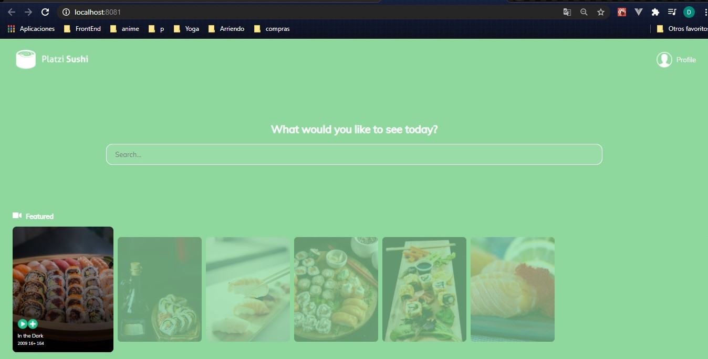

## Proyecto - Platzi Sushi

Es un proyecto realizado con la tecnología de **react** que un framework que nos permite trabajar con las interfaces de usuario de forma más eficiente y sencilla.

## Resultados:

<div align="center">
  
  
</div>

## Comandos:

1. **Inicializar el proyecto:**
   ```npm run start```

2. **Inicializar la FAKEAPI:**
   ```json-server initialState.json```

## Herramientas utilizada:

1. **React y React-DOM:**
  ``` npm install react react-dom ```
2. **Babel:**
   ``` npm install @babel/core babel-loader @babel/preset-env @babel/preset-react --save -dev ```
3. **WebPack:**
   ``` npm install webpack webpack-cli html-webpack-plugin html-loader file-loader --save-dev  ```
4. **Saas:**
5. ```npm install --save-dev mini-css-extract-plugin css-loader node-sass sass-loader ```
6. **Eslint:**
   ``` npm install --save-dev eslint babel-eslint eslint-config-airbnb eslint-plugin-import eslint-plugin-react eslint-plugin-jsx-a11y    ```
7. **Proptypes:**
  ``` npm install --save prop-types ```
8. **Json-Server:**
  ```sudo npm install json-server -g ```
9. **Fontawesome:**
  ``` npm i --save @fortawesome/fontawesome-svg-core ```
  ``` npm install --save @fortawesome/free-solid-svg-icons ```
  ``` npm install --save @fortawesome/react-fontawesome ```
